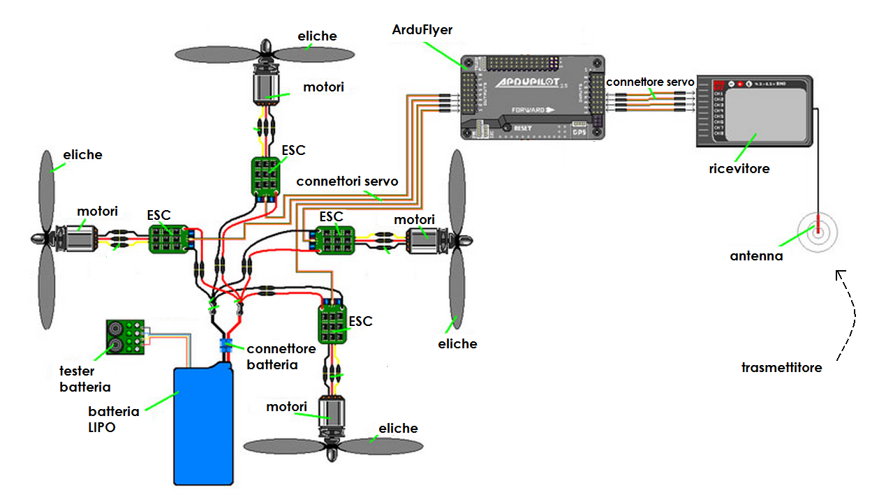

# Quadricottero
Progetto finale svolto per l'esame di quinta superiore all' Istituto superiore “Enrico Fermi” (MN).

## Descrizione del progetto
Il progette verte sulla progettazione e assemblaggio dei componenti necessari per la realizzare di un quadricottero comandato tramite radiocomodando.

## Hardware utilizzato
-	Radiocomando, con annesso ricevitore, per pilotare il quadricottero da remoto
-	Scheda di controllo Ardupilot APM 2.8 per garantire la stabilizzazione del quadricottero e regolare la velocità dei motori a seconda dei segnali ricevuti dal ricevitore
-	4  ESC (electronic speed control) per il controllo e la regolazione della velocità dei motori
-	4 motori brushless con potenza 970 KV (giri al minuto per volt) 
-	Batteria Lipo a 3 celle per alimentare tutti i componenti elettronici presenti sul quadricottero (in particolare i motori)
-	Tester per la batteria Lipo per ricevere un segnale sonoro quando la batteria è prossima alla scarica completa
-	Telaio in legno costruito su misura

## Schema di cablaggio

  

## Cablaggio

  

## Test finale
Video integrale del test finale può essere trovato al seguente [link](https://www.youtube.com/watch?v=8E-qSqBvzQY&feature=youtu.be).

  

